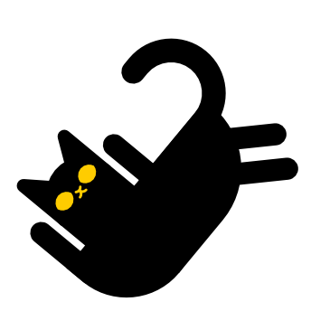

# HkbEditor
This program allows you to edit Havok behavior graphs which are used in several FromSoft games like Nightreign, Elden Ring, and Sekiro - Shadows Die Twice. 

Behaviors are one of the more obscure subsystems in these games, controling which animations to play or add on top of each other, as well as how to transition between them. This is modeled in the form of state machines where each state controls (part of) an animation. States can transition to new states either automatically, or by triggering events from HKS, the script files handling player input and game state.

# How to use
Once you've loaded a behavior, click one of the state machines on the left. This will create a node in the center view. Clicking on this node will show its attributes on the right panel, and "unfold" it to show its child nodes. 

You can use the center view to navigate deeper into this node network. Use the *middle mouse button* or *alt + left mouse button* to move around, *left click* to select, and *right click* to open a context menu. You can also zoom in and out using the *mouse wheel*. Right click in an empty spot to reset your view.

Check out the [guide](https://github.com/ndahn/HkbEditor/blob/main/doc/guide.md) to learn how to use this program!

# In case something breaks
If you find any bugs or missing features, preferably create an issue here on github. Alternatively, ping me *@managarm* over on [?ServerName?](https://discord.gg/wzMynmW).
