# So you want to Behavior?
An excellent choice, good madam/sir! I highly appreciate your distinguished taste. And dare I say, you’re looking marvelous today. Did you apply *\<insert appropriate cosmetic stuff>* recently? Excuse me, your charm made me digress. Behaviors. Right…

***TODO img behaviors are cool***

# Why should you care about behaviors?
Behaviors are the glue between player inputs and animations and have been used in most recent Fromsoft titles: *Dark Souls 3, Sekiro, Elden Ring, Nightreign* (Armored Core 6 uses a different system). They control which animation to play, how to transition into other animations, allow to layer animations on top of each other, and more. It’s a fairly complex system that you will most likely get exposed to if you are getting into movesets (although there are also some weapons and other things that have behaviors). Even then you will probably only touch the surface, especially if you stay within the realms of what the game already does (e.g. up to 6 light attacks, 2 heavy attacks, etc.). 

However, once you leave these familiar waters things start to look different. Different stance poses depending on the weapon type? Behavior. Custom idles without creating an entire idle category? Behavior. New throw attacks and reactions? Behavior...


> Variations of the "Square Off" ash of war, courtesy of the amazing *Raster*

Of course, even if you don’t plan to do anything like this, it’s nice to have a little more insight into how the game works. If this sounds even mildly interesting to you, read on!

# What you will need
- [Nuxe](https://github.com/JKAnderson/Nuxe): for unpacking the game
- [WitchyBND](https://github.com/ividyon/WitchyBND): for unpacking the archive files
- [HKLib](https://github.com/The12thAvenger/HKLib/): for converting .hkb behavior files to .xml
- [HkbEditor](https://github.com/ndahn/HkbEditor): for editing the .xml files

> Latest versions can always be found under *releases*!

> If any tool doesn't work, first make sure that you got the most recent version from **Github**. Check the Readme if you have to install any other requirements, many tools will need the .net runtime. 

> I will personally murder anyone who tries to use Yabber or similar instead of WitchyBND. 

# Getting ready
First, unpack the tools mentioned above. WitchyBND can and should be installed, the others will just sit inside their folder.

Now unpack your game using *Nuxe*. For movesets you at the very least want to extract the `chr` folder. Weapons are in `parts`, for other stuff you'll have to ask around.

Next, find the `.behbnd.dcx` of the thing you want to edit, e.g. `chr/c0000.behbnd.dcx` for the player character. Right click it and use *WitchyBND* to unpack it. This will extract the contents into a similarly named folder. 

Inside said folder you will find a few more files and folders, but the one we are interested in is inside the `Behavior` folder. Open it; you should see a file like `c0000.hkx`. This is the behavior file in binary format. Drop it onto the *HKLib* .exe and it will be converted to a (rather large) .xml file.

> Unfortunately, at the time of writing HKLib only supports Elden Ring and Nightreign. For older games like Sekiro and Dark Souls 3 there are ways to generate an xml using Dropoff's hkxconverter. If you find someone who has extracted these before you can use those as well. More on this in [[#Saving changes]].

> Note that .hkx is a fairly common extension within the Havok framework. Not every .hkx file is a behavior!

# First steps
> For this tutorial I will assume you'll be editing Elden Ring's player character's behavior (c0000). This won't matter in most cases, but a few things like ashes of war (weapon skills) will be called different in other games.

For editing behaviors we'll be using the program I wrote, *HkbEditor*. Open it and select *File -> Open*, then navigate to the .xml file you extracted earlier. Depending on the file size this can take a couple of seconds to load.

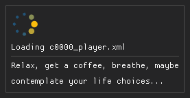

> You can also open a .behbnd.dcx or .hkx file directly. In this case HkbEditor will ask you for the locations of WitchyBND and HkLib so it can take care of the conversion, but I wanted you to understand the process :)

Once loaded you will be greeted with a list of items on the left side. These are the behavior's state machines. I'll explain their role later on, but for now let's get familiar with the user interface. 

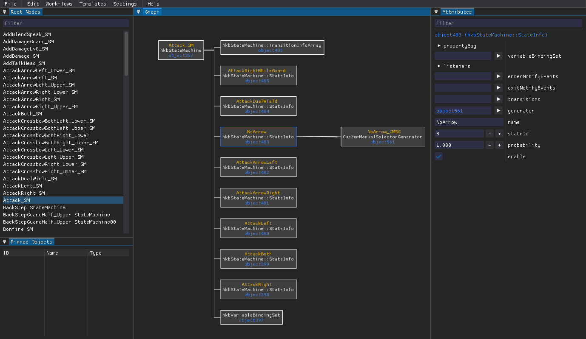

Click one of the state machines. This will create a node in the center view. Clicking on this node will show its attributes on the right panel, and "unfold" it to show its child nodes. You can use the center view to navigate deeper into this node network (which is called a (directed) graph). Use the *middle mouse button* to move around, *left click* to select, and *right click* to open a context menu. You can also zoom in and out using the *mouse wheel*. Right click in an empty spot to reset your view.

# Anatomy of a behavior

## Nodes
Every node in the graph has two things: a unique identifier, e.g. *object1234*, and a type, e.g. *hkbStateMachine*. 

> Note that object IDs are **not** stable - they can and will change as you convert between the binary and xml representations.

The type defines which attributes the object has and what their types are. Every attribute consists of a field name and a value. The fundamental attribute types are:
- Integer (*whole numbers*)
- Float (*decimal numbers*)
- Boolean (*true/false*)
- String (*text*)
- Pointer (*reference to another object*)
- Record (*complex object with attributes*)
- Arrays (*lists of values of one of the above types*)

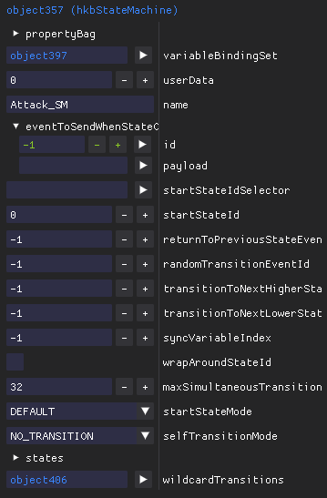

In HkbEditor, pointers are used for creating the graph representation, and each node displays at least its ID and type. Most nodes also have a "name" attribute, which will also be shown. 

> Note that in Havok terms, only these named nodes are proper behavior nodes, but there are very few cases where this matters.

## State machines
As hinted earlier, Havok behaviors are essentially graphs of state machines. All state machines have one or more states (of type *hkbStateMachine::StateInfo*), and while most states will branch into a variety of animations, they may also contain additional state machines. In this way, more than one state machine can be active at any time, and there is a single root state machine (typically called *Root*) to which all others are indirectly connected.

In HkbEditor, all state machines are listed on the left in alphabetical order, regardless of where they appear in the hierarchy. This means that if you start from e.g. the "Attack_SM" state machine, it is possible to navigate to the "AttackRight_SM". 

## Events
States are activated via *Events*. If you have edited one of the games' HKS scripts before you will probably be familiar with lines similar to `ExecEvent("W_SwordArtsOneShot")`. This tells the behavior to activate all states (and state machines) that listen to the *W_SwordArtsOneShot* event. The associations between events and states are stored in the state machine's *wildcardTransitions*. This object stores a *transitions* array in which these associations are stored.

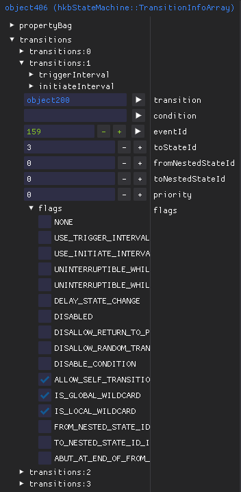

You will notice that the *eventId* and *toStateId* attributes are using numbers rather than names. This is fairly common in behaviors. State IDs can be freely defined and are set in the state's *stateId* attribute. Events are stored in a separate list though, and as they are referenced by their index, changing their order or inserting new events in between would screw up everything that comes after. To view, edit and add events you can use the *Edit -> Events* dialog. To select a new event for an event attribute, either enter its index or use the *arrow button* next to the attribute to select an existing event.

> Note that transitions that reference non-existing states or statemachines containing duplicate state IDs will cause the game to crash.

## Variables
Most attributes can also be bound to a variable. In this case they will no longer have a fixed value, but can be controlled via HKS. If you have seen something like `SetVariable("ItemWeaponType", 1)` you are actually changing the value of some behavior attribute. This is quite powerful, and is used in Elden Ring for example to select different a different roll type based on the current weight. These can also be set from the animation by using TAE 605 (*SetTimeActEditorHavokVariable*). As with events, variables are referenced by their index and can be edited via *Edit -> Variables*. 

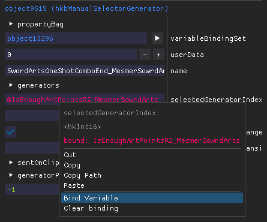

In order to bind a variable, right click a bindable attribute and select *Bind Variable*. Note that you can only bind attributes of nodes that have a *variableBindingSet* attribute (which is the object where the binding is stored). This is true for all proper behavior nodes.

## Animations
Probably what most people will care about, and so of course I put it towards the end :) 

In order to play back an animation a behavior needs 3 things:
- A state to activate
- An event to activate the state
- And a *hkbClipGenerator* object

The first two should be clear by now, and the clip generator will be shortly. It's a relatively simple object that crucially defines which animation to play, as well as various playback parameters like playback speed, what to do once the animation finishes (e.g. nothing or loop), etc.

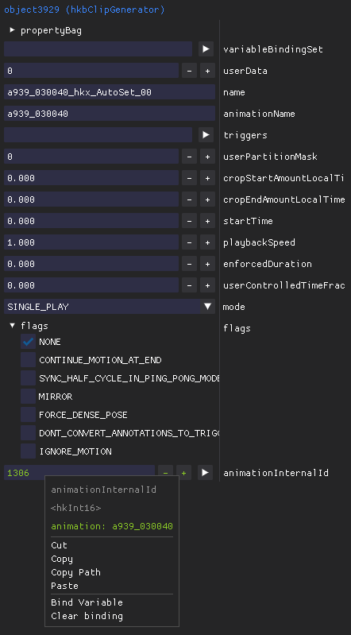

Each animation must be registered in a global list (similar to how events and variables are handled). You can edit this list from the *Edit -> Animations* dialog.

However, there are usually a couple more objects between a clip generator and its state, and this is where the magic comes in.

## CMSG & Manual Selectors
Let's say you are creating a new ash of war for Elden Ring. The animation is ready, everything is setup, you just need to execute it somehow. You open a state machine and... hm. Do you really want to add an entire new state to it? You would have to create a new event, too. And you couldn't reuse all the HKS code for checking sufficient stamina, player input, weapon type, FP cost,... Not a good option.

Looking at Elden Ring's *SwordArts_SM* (which is the general state machine for ashes of war), you notice that it actually has a fairly complex structure. First there are different states for different variations like shield, charged, stances, etc., some of which lead to other state machines like *SwordArtsStance_SM*. But even the most basic state - *SwordArtsOneShot* (040000 and related) - contains a *ManualSelectorGenerator* object, which again has more manual selectors and... what's going on?

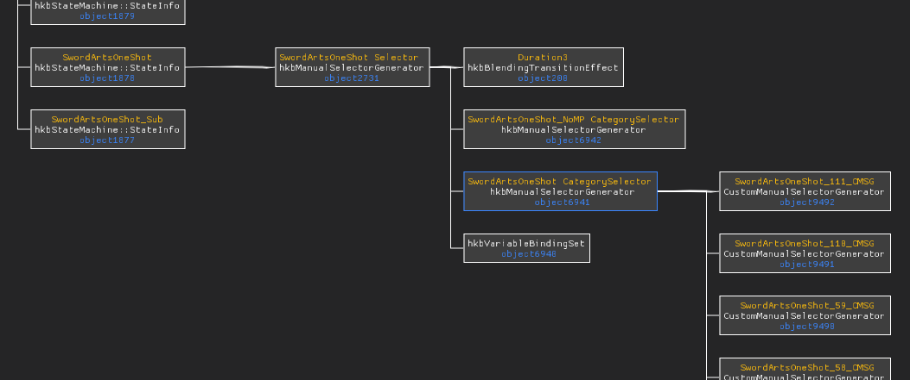

A *ManualSelectorGenerator* will activate one of its children (the generators) based on its *selectedGeneratorIndex* attribute. This attribute is usually bound to a variable, in the case of the first selector *IsEnoughArtPointsR2*. This makes it easy to execute either the 040000 or 040005 animation depending on whether your character currently has enough FP! The subsequent manual selectors use the *SwordArtsOneShotCategory* variable to play back different animations based on the weapon type you're holding. In HKS the latter looks similar to this this (simplified for the sake of this guide):

```lua
local arts_cat = GetSwordArtsCategory()
local arts_idx = 0

if arts_cat == WEAPON_CATEGORY_LARGE_KATANA then
    arts_idx = 1

elseif arts_cat == WEAPON_CATEGORY_POLEARM then
    arts_idx = 2

elseif arts_cat == WEAPON_CATEGORY_SHORT_SWORD then
    arts_idx = 3

-- and so on...
end

SetVariable("SwordArtsOneShotCategory", arts_idx)
ExecEventAllBody("W_SwordArtsOneShot")
```

You could of course now create a separate generator for every different ash of war, weapon type, and attack and use variables to meticulously decide which animation to play back. But this system will fail in many unintuitive ways - for example if you insert a new animation in between the already existing generators. 

The better way to do this is to use what's called a *CustomManualSelectorGenerator*, or CMSG for short. This object will select a single clip generator from its children based on e.g. the currently equipped ash of war. Other options include selected magic, idle category, weapon type, etc. CMSGs are also responsible for calling HKS functions based on their name. For example, a CMSG called *SwordArtsOneshotComboEnd_CMSG* will also call the following HKS functions (if they exist and *enableScript* is set to true):
- SwordArtsOneshotComboEnd_onActivate
- SwordArtsOneshotComboEnd_onUpdate
- SwordArtsOneshotComboEnd_onDeativate

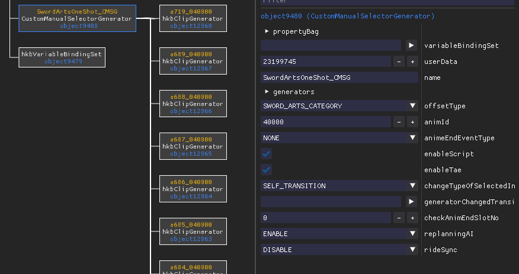

This means that in order to use a new ash of war you simply need to add a *hkbClipGenerator* to the appropriate CMSG. In HkbEditor this can be done by selecting *Workflows -> Register Clip*, whereas *Create CMSG* will create a new state, CMSG and clip generator.

> This is essentially what *ERClipGenerator* does: it looks for already known animation IDs and creates clip generator objects in the corresponding CMSGs.

## Blend Layers & Other Objects
I currently don't know enough about these to explain (or use) them. Your best bet is to look at existing structures and ask around on *?ServerName?*. 

# Behaving how you want to
This section will outline how to actually use HkbEditor to edit your behavior. At this point I assume that you somewhat know what you want to achieve and have understood the basics above.

## Saving changes
Once you're happy with your changes you'll want to save your behavior. Note however that this will save everything as xml. For your changes to take effect you have to repack the `behbnd.dcx` binder.

For Elden Ring and newer, HKLib supports converting back to .hkx, and you should do this to save both on loading times and file size. Unfortunately though, this is right now not supported for older titles like Sekiro or Dark Souls 3. Luckily for us we can use the .xml without conversion (apparently it's inherently supported by Havok). For this to work, edit the ***TODO*** file WitchyBND created and change the file extension of the file you edited from .hkx to .xml.

Next, you'll have to repack the `behbnd.dcx` binder. Simply right click the folder and use WitchyBND to pack it. 

For titles with HKLib support you can also do this from within HkbEditor. Simply hit *F4* or select *File -> Repack binder* and it will save, convert and repack the behavior.

### Hot reloading
As most parts of modding, editing behaviors is often an iterative process. To save you some time you can directly reload the character for some of the games (right now only Elden Ring). To do this press *F5* or select *File -> Force game reload*. You know it worked if your character briefly disappears.

### Name ID files
If you have created new events, variables, or animations, they must also be added in 3 additional files which can be found under `action/{event|variable|animation}nameid.txt`. As these contain entries from ALL NPCs, cutscenes, weapons and so on it is not possible to generate them automatically yet. However, HkbEditor can update them with your additional items by selecting *File -> Update name ID files*. If your mod doesn't include them yet, simply copy them from the extracted game files to your mod folder. 

***TODO screenshot name ID files***

## Finding objects
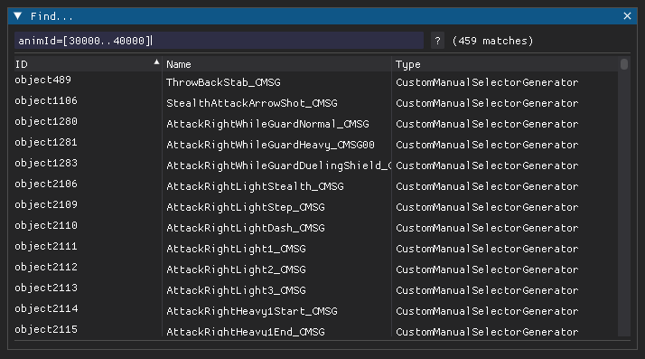

Pressing *ctrl-f* (or selecting *Edit -> Find Objects*) will open a search dialog which you can use to - well, search for objects. In case this helps you, the search syntax is *inspired by* lucene (but not quite the same; personally I have no clue what it is :D ). 

You search for objects by specifying `<field>=<value>` tuples, where *field* is the name of an attribute and *value* the value results must have. In case of nested attributes you can also use a *field path* for the field - right click an attribute and select *Copy -> Path* for this. The field can also be one of *id, object_id, type, type_id, type_name*. These will also be checked if no field is specified.

Multiple tuples are combined by using *AND* or *OR* (spaces are also treated as *AND*). You can also exclude objects by preceding a tuple with *NOT*. If your value contains spaces you may surround it with *single* (*'*) or *double quotes* (*"*). To search for a range of numbers use *[lower..upper]* as your value. Finally, to search for similar values you may add a tilde (*~*) in front of your value.

Here are some examples:
- `bindings:0/memberPath=selectedGeneratorIndex`
	- Find VariableBindingSets that are binding a ManualSelectorGenerator
- `id=*588 type:hkbStateMachine* 
	- Find objects who's ID ends with 588 *and* have a type name starting with hkbStateMachine (this one is pretty useless)
- `NOT animId=[100000..200000]`
	* Find all objects that have an animId attribute with its value outside a certain range
- `name=~AddDamageFire`
	* Find objects with similar names

## Creating new objects
To create new objects you have various choices. The most immediate one is to right click a pointer attribute and selecting *New object*. This will open a dialog which lets you select the object type and adjust its attributes. Once created, it will be added to the behavior and update the selected pointer. You can do the same by right clicking a node in the graph view and choosing a pointer attribute from the *Attach* menu, then select *New object*. There is also *Workflows -> Create object* which will create "orphaned" objects, i.e. objects without any parents. 

### Duplicating objects
If you instead want to duplicate an object you can do so by right clicking its node in the graph view and selecting *Copy -> XML*. This will copy this object as xml text to your clipboard. To paste the object, find a pointer attribute that will accept it (i.e. you cannot attach a *StateInfo* to a CMSG). Right click the pointer attribute and select *Paste*; or right click the node, navigate to the pointer attribute in the *Attach* menu and select *From XML*. A copy of the object with a new ID will be created and the pointer will be updated to it.

> Note that when copying objects all their pointers will point at the same objects as the original. If this is not what you want see the section on [[#Cloning hierarchies]] below.

### Pinned objects
For most operations that create new objects, whether they are abandoned or not, the new objects will also be pinned. This means they will appear in the small table below the list of state machines. Pinned objects allow you to quickly switch between objects to e.g. copy values or jump between them. Objects can also be pinned from the graph view's node context menu.

## Cloning hierarchies
Sometimes you want to clone an entire hierarchy of objects. To do just that, right click a node from the graph view and select *Copy -> Hierarchy*. This will copy the hierarchy as xml to your clip board together with some meta data required for reconstruction (more on this in a bit). To paste it, either right click a pointer attribute and select *Clone Hierarchy*, or use a node's *Attach* menu and select *Hierarchy* on the pointer attribute you want. 

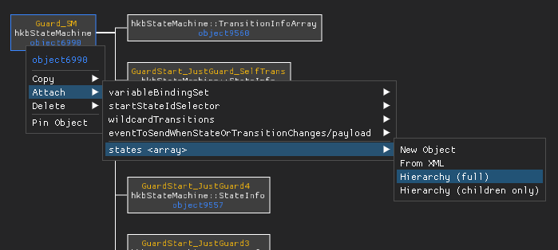

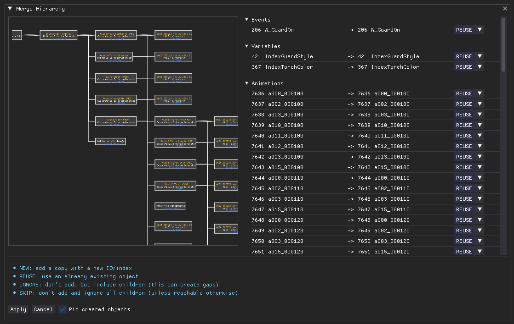

> Hierarchies can be copied between games as long as all object types exist! Sorry, no Sekiro wall hugging for Elden Ring :(

This will open a dialog showing you the copied structure on the left. On the right you'll find a table of items that are about to be copied, including objects, events, variables, etc. For items that already exist in your behavior you can choose to reuse the existing ones rather than creating copies. If you don't want to include an object or any of its children set its action to *SKIP*. Then hit okay once you're happy with it.

### Cloning children
> Here at *Strex Corp* we are strictly in favor of all evils deeds. As such, cloning children is one of our most cultured activities >:D 

There are cases where you want to clone an object's children without the object itself. HkbEditor supports this as well! For this to work, copy the hierarchy as usual. Next, use the *Attach* menu to locate a *pointer array* in your target object (e.g. the *generators* attribute of a CMSG). These are separated by a line from regular pointer attributes. Choose *Hierarchy (children only)* from the sub menu and proceed as usual.

### Merging behaviors
Cloned hierarchies are also the current approach to merging behaviors. After copying a hierarchy, paste it into a text file and save it as .xml. In order to import it, select *Workflows -> Import Behavior*. This will open the cloning dialog from before and will place the saved behavior in the same place where it was found in the original. 

## Mirrored animations
HkbEditor also covers some more obscure corner cases. One of them is mirroring skeletons. This is useful when you have an animation and want to flip it left <-> right without editing it. As Fromsoft never uses this, most characters are not properly setup for this. 

In order to fix a character's mirror definitions, select *Workflows -> Generate Bone Mirror Map*. In the new dialog, first load the `Skeleton.xml` file for your character (***TODO how to***). Then select *Auto Mirror* at the bottom. This will generate a mirrored bone mapping based on the `_L`/`_R` suffixes of the bones. Save the resulting xml to the `Character` folder of your extracted `behbnd.dcx` and convert it back using HKLib.

In order to mirror an animation, find the corresponding *hkbClipGenerator* and set the *MIRROR* flag.

# Templates
Sometimes you have a more complex task that is tedious to do by hand. Maybe you want to create 50 new clip generators. Maybe you want to rename every node inside a certain state machine. Whatever the case, templates got you covered!

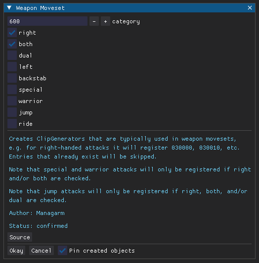

Templates are small(ish) python scripts that can automate behavior edits. Each template must have a `run()` function which takes a *TemplateContext* object as its first argument. Templates are smart in the way that all additional arguments as well as the docstring are used for generating a dialog. 

The TemplateContext object provides various methods for creating and editing objects, events, variables and animations, create variable bindings, find specific objects, and so on. The API is *mostly* stable, so the best way to learn how to write templates is by looking at the [documentation] ***TODO*** as well as the already included templates and example. 

> As the names of state machines and CMSGs tend to change between games, most templates are game specific. There is some overlap between Elden Ring and Nightreign, but as of now this hasn't really been explored.

# In case you screwed up
It's possible to screw up your behavior in more or less subtle ways that can lead to game crashes (if you can convert it back at all). Whether it was a bug or your own doing, the first thing you should do is run the *Workflows -> Verify Behavior* function. Carefully check the terminal output for any problems and try to fix them, then save again and retry.

## Shooting troubles
If something just doesn't work, always check the terminal for errors. If you think something went wrong that should have worked, either open a Github issue or contact *@Managarm* on *?ServerName?*. Make sure to include as many details as possible - at the very least what you did and what the error was.