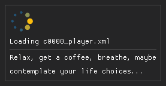

# First steps

## What you will need
- [Nuxe](https://github.com/JKAnderson/Nuxe): for unpacking the game
- [WitchyBND](https://github.com/ividyon/WitchyBND): for unpacking the archive files
- [HKLib](https://github.com/The12thAvenger/HKLib/): for converting .hkb behavior files to .xml
- [HkbEditor](https://github.com/ndahn/HkbEditor): for editing the behavior .xml files

???+ tip

    Latest versions can always be found under *releases*!

???+ note

    If any tool doesn't work, first make sure that you got the most recent version from **Github**. Check the Readme if you have to install any other requirements, many tools will need the .net runtime. 

???+ danger

    I will personally murder anyone who tries to use Yabber or similar instead of WitchyBND. 

---

## Preparation
First, unpack the tools mentioned above. WitchyBND can and should be installed, the others will just sit inside their folder.

Now unpack your game using *Nuxe*. For movesets you at the very least want to extract the `chr` folder. Weapons are in `parts`, for other stuff you'll have to ask around.

Next, find the `.behbnd.dcx` of the thing you want to edit, e.g. `chr/c0000.behbnd.dcx` for the player character. Right click it and use *WitchyBND* to unpack it. This will extract the contents into a similarly named folder. 

Inside said folder you will find a few more files and folders, but the one we are interested in is inside the `Behavior` folder. Open it; you should see a file like `c0000.hkx`. This is the behavior file in binary format. Drop it onto the *HKLib* .exe and it will be converted to a (rather large) .xml file.

??? warning
    
    Unfortunately, at the time of writing HKLib 0.12 **only** supports Elden Ring, and HKLib 0.13 **only** supports Nightreign. For older games like Sekiro and Dark Souls 3 there are ways to generate an xml using Dropoff's hkxconverter. If you find someone who has extracted these before you can use those as well.

???+ info
    
    Note that .hkx is a fairly common extension within the Havok framework. Not every .hkx file is a behavior!

---

## What goes where
???+ tip

    For this tutorial I will assume you'll be editing Elden Ring's player character's behavior (c0000). This won't matter in most cases, but a few things like ashes of war (weapon skills) will be called different in other games.

For editing behaviors we'll be using *HkbEditor*, courtesy of yours truely. Open it and select *File -> Open*, then navigate to the .xml file you extracted earlier. Depending on the file size this can take a couple of seconds to load.

???+ tip

    You can also open a .behbnd.dcx or .hkx file directly. In this case HkbEditor will ask you for the locations of WitchyBND and HkLib so it can take care of the conversion, but I wanted you to understand the process :)

Once loaded you will be greeted with a list of items on the left side. These are the behavior's state machines. I'll explain their role later on, but for now let's get familiar with the user interface. 

Click one of the state machines. This will create a node in the center view. Clicking on this node will show its attributes on the right panel, and "unfold" it to show its child nodes. You can use the center view to navigate deeper into this node network (which is called a (directed) graph). Use the `middle mouse button` or `alt + left mouse button` to move around, `left click` to select, and `right click` to open a context menu. You can also zoom in and out using the `mouse wheel`. Right click in an empty spot to reset your view.
