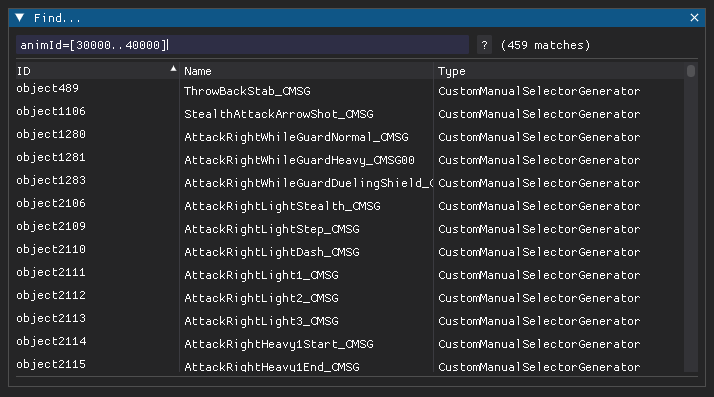

# Behaving how you want to
This section will outline how to actually use HkbEditor to edit your behavior. At this point I assume that you somewhat know what you want to achieve and have understood the basics above.

When editing behaviors you should typically rely on making small incremental changes. The most common use cases - registering clips and creating CMSGs - can be found in the *Workflows* menu. To create new hierarchies you would typically start by creating a new target for a pointer (e.g. a new StateInfo for a state machine, or a new entry for a CMSG's generators). 

If you have something more complex in mind, definitely have a look at the [Templates](../templates/overview.md).

---

## Saving changes
Once you're happy with your changes you'll want to save your behavior. Note however that this will save everything as xml. For your changes to take effect you have to repack the `behbnd.dcx` binder.

For Elden Ring and newer, HKLib supports converting back to .hkx, and you should do this to save both on loading times and file size. Unfortunately though, this is right now not supported for older titles like Sekiro or Dark Souls 3. Luckily for us we can use the .xml without conversion (apparently it's inherently supported by Havok). For this to work, edit the `_witchy-bnd4.xml` file WitchyBND created inside the unpacked folder and change the file extension of the *Behaviors/<your-file>.hkx* file to .xml.

Next, you'll have to repack the `behbnd.dcx` binder. Simply right click the folder and use WitchyBND to pack it. 

For titles with HKLib support you can also do this from within HkbEditor. Simply hit *F4* or select *File -> Repack binder* and it will save, convert and repack the behavior.

### Hot reloading
As most parts of modding, editing behaviors is often an iterative process. To save you some time you can directly reload the character for some of the games (right now only Elden Ring). To do this press *F5* or select *File -> Force game reload*. You know it worked if your character briefly disappears.

### Name ID files
If you have created new events, variables, or animations, they must also be added in 3 additional files which can be found under `action/{event|variable|animation}nameid.txt`. As these contain entries from ALL NPCs, cutscenes, weapons and so on it is not possible to generate them automatically yet. However, HkbEditor can update them with your additional items by selecting *File -> Update name ID files*. If your mod doesn't include them yet, simply copy them from the extracted game files to your mod folder. 

???+ danger

    Calling events that are not in the `eventnameid.txt` file will usually crash your game!

---

## Finding objects

Pressing *ctrl-f* (or selecting *Edit -> Find Objects*) will open a search dialog which you can use to - well, search for objects. In case this helps you, the search syntax is *inspired by* lucene (but not quite the same; personally I have no clue what it is :D ). 

You search for objects by specifying `<field>=<value>` tuples, where *field* is the name of an attribute and *value* the value results must have. In case of nested attributes you can also use a *field path* for the field - right click an attribute and select *Copy -> Path* for this. The field can also be one of *id, object_id, type, type_id, type_name, parent*. These will also be checked if no field is specified.

Multiple tuples are combined by using *AND* or *OR* (spaces are also treated as *AND*). You can also exclude objects by preceding a tuple with *NOT*. If your value contains spaces you may surround it with *single* (*'*) or *double quotes* (*"*). To search for a range of numbers use *[lower..upper]* as your value. Finally, to search for similar values you may add a tilde (*~*) in front of your value.

Here are some examples:
- `bindings:0/memberPath=selectedGeneratorIndex`
    - Find VariableBindingSets that are binding a ManualSelectorGenerator
- `id=*588 type:hkbStateMachine* 
    - Find objects who's ID ends with 588 *and* have a type name starting with hkbStateMachine (this one is pretty useless)
- `NOT animId=[100000..200000]`
    * Find all objects that have an animId attribute with its value outside a certain range
- `name=~AddDamageFire`
    * Find objects with similar names

---

## Creating new objects
To create new objects you have various choices. The most immediate one is to right click a pointer attribute and selecting *New object*. This will open a dialog which lets you select the object type and adjust its attributes. Once created, it will be added to the behavior and update the selected pointer. You can do the same by right clicking a node in the graph view and choosing a pointer attribute from the *Attach* menu, then select *New object*. There is also *Workflows -> Create object* which will create "orphaned" objects, i.e. objects without any parents. 

### Duplicating objects
If you instead want to duplicate an object you can do so by right clicking its node in the graph view and selecting *Copy -> XML*. This will copy this object as xml text to your clipboard. To paste the object, find a pointer attribute that will accept it (i.e. you cannot attach a *StateInfo* to a CMSG). Right click the pointer attribute and select *Paste*; or right click the node, navigate to the pointer attribute in the *Attach* menu and select *From XML*. A copy of the object with a new ID will be created and the pointer will be updated to it.

???+ note

    Note that when copying objects all their pointers will point at the same objects as the original. If this is not what you want see the section on [Cloning hierarchies](#cloning-hierarchies) below.

### Pinned objects
For most operations that create new objects, whether they are abandoned or not, the new objects will also be pinned. This means they will appear in the small table below the list of state machines. Pinned objects allow you to quickly switch between objects to e.g. copy values or jump between them. Objects can also be pinned from the graph view's node context menu.

---

## Cloning hierarchies
Sometimes you want to clone an entire hierarchy of objects. To do just that, right click a node from the graph view and select *Copy -> Hierarchy*. This will copy the hierarchy as xml to your clip board together with some meta data required for reconstruction (more on this in a bit). To paste it, either right click a pointer attribute and select *Clone Hierarchy*, or use a node's *Attach* menu and select *Hierarchy* on the pointer attribute you want. 

???+ tip

    Hierarchies can be copied between games as long as all object types exist! Sorry, no Sekiro wall hugging for Elden Ring :(

This will open a dialog showing you the copied structure on the left. On the right you'll find a table of items that are about to be copied, including objects, events, variables, etc. For items that already exist in your behavior you can choose to reuse the existing ones rather than creating copies. If you don't want to include an object or any of its children set its action to *SKIP*. Then hit okay once you're happy with it.

### Cloning children
???+ tip

    Here at *Strex Corp* we are strictly in favor of all evils deeds. As such, cloning children is one of our most cultured activities >:D 

There are cases where you want to clone an object's children without the object itself. HkbEditor supports this as well! For this to work, copy the hierarchy as usual. Next, use the *Attach* menu to locate a *pointer array* in your target object (e.g. the *generators* attribute of a CMSG). These are separated by a line from regular pointer attributes. Choose *Hierarchy (children only)* from the sub menu and proceed as usual.

### Merging behaviors
Cloned hierarchies are also the current approach to merging behaviors. After copying a hierarchy, paste it into a text file and save it as .xml. In order to import it, select *Workflows -> Import Behavior*. This will open the cloning dialog from before and will place the saved behavior in the same place where it was found in the original. 

---

## Mirrored animations
HkbEditor also covers some more obscure corner cases. One of them is mirroring skeletons. This is useful when you have an animation and want to flip it left <-> right without editing it. As Fromsoft never uses this, most characters are not properly setup for this. 

???+ example

    This process requires a `Skeleton.xml` file. To generate it, either use Havok's `FileConvert.exe --xml {Skeleton.hkx} {Skeleton.xml}`, or use *Havok Content Tools*. For the latter, prune all animation data except for the skeleton, then write to platform as XML. If all of this sounds like arcane sorcery, ask around on [*?ServerName?*](https://discord.gg/J5msG6Es) and someone can probably send you the .xml.

In order to fix a character's mirror definitions, select *Workflows -> Generate Bone Mirror Map*. In the new dialog, first load the `Skeleton.xml` file for your character. Then select *Auto Mirror* at the bottom. This will generate a mirrored bone mapping based on the `_L`/`_R` suffixes of the bones. Save the resulting xml to the `Character` folder of your extracted `behbnd.dcx` and convert it back using HKLib. 

In order to mirror an animation, find the corresponding *hkbClipGenerator* and set the *MIRROR* flag.
