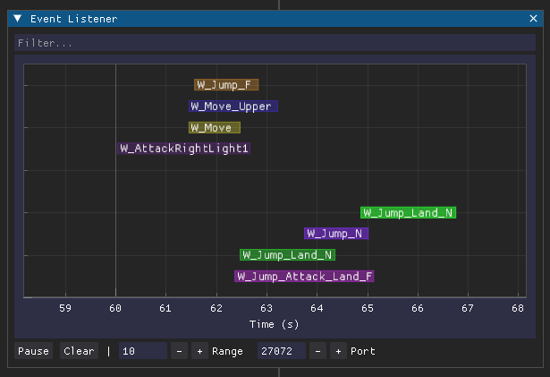

# Event Listener

The event listener is a DLL that hooks into the game to expose the fired events. More specifically, it detours the internal `hkbFireEvent` function to print out the received event string. 

???+ info

    This tool is extremly useful when working on more complex behaviors where many behavior transitions happen in a short time, e.g. jump attacks (jump start to jump loop to jump attack to landing to running to...).

To use it, place the `hkb_event_listener.dll` and `hkb_event_listener.yaml` files inside your mod folder (the latter is an optional configuration file you can edit by hand). Then add the following lines to your ME3 profile:

```toml
[[native]]
path = "hkb_event_listener.dll
```

Any fired events that match the filters from the config file will be printed to the terminal. By default this only print events from `c0000` (the player character). This too can be changed in the config.

---

## GUI

Once you start the game you may also be able to spot a short message saying that events will now be published at the configured address (`127.0.0.1:27072` by default). HkbEditor has a tool to visualize these events over time called which you can find under *Tools -> Event Listener*.



By default the listener will listen to UDP port 27072. The visualization is somewhat basic right now, but can help with some more complex behaviors. More features will be added in future versions (and maybe on request).
